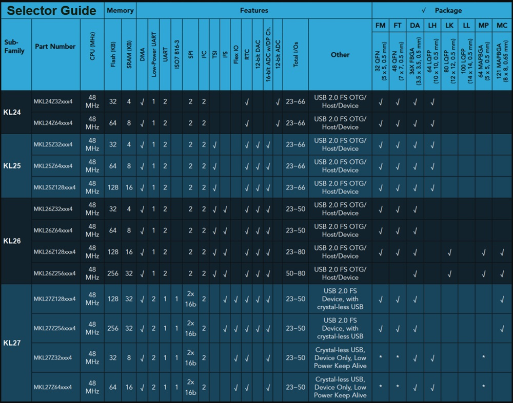
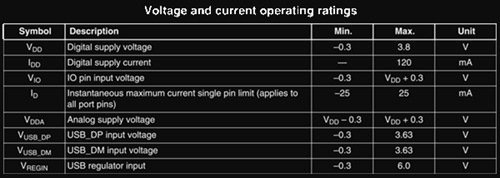
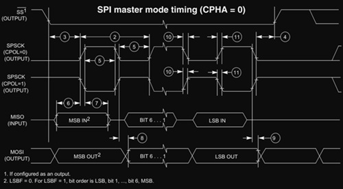
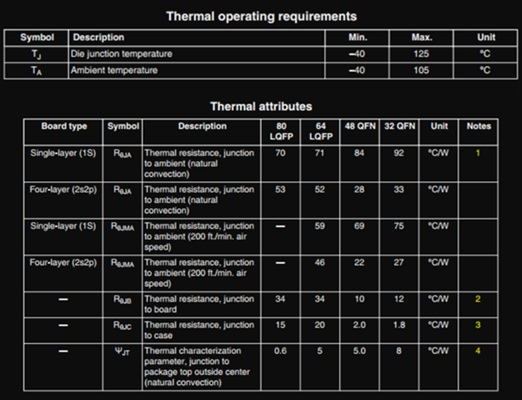
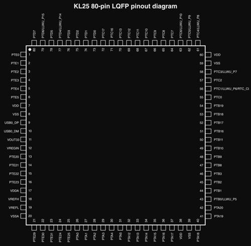
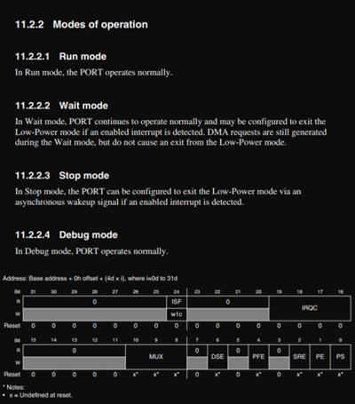
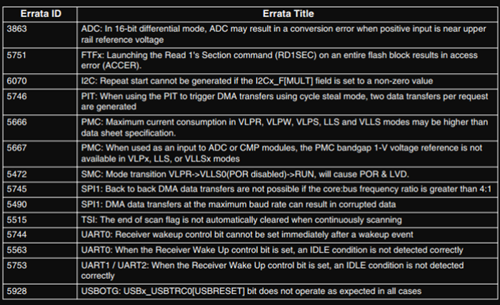

# Programming Environment & Development Tools

#### **[⇐ Embedded Systems](./README.md)**

* **[C Programming Language](./Tools/C.md)**

* **[Version Control](./Tools/Version-Control.md)**

* **[Ubuntu CLI](./Tools/Ubuntu-CLI.md)**
---

## Environments
- Compilers - GCC
- Debuggers
- CLI (Command Line Interface)
- IDE (Integrated Development Environment)
- Version Control
- Automation Tools - GNU Make

### Software Requirements
- **IDE (Integrated Development Environment)** - Provided for free by vendors e.g. CCS for MCUs from Texas Instruments

- **Serial Terminal Emulator** - RealTerm, Putty
- **Linux Development Environment** - VirtualBox with an Ubuntu Linux image, Virtual Machine Hypervisor
- **Linux Distribution** - Ubuntu LTS
- **Linux Packages** - git, GCC (host version), ARM Embedded GCC (Cross-Compiler version)
- **Text Editor** (for Linux)
    - CLI - Vim, Nano or Emacs
    - GUI - Sublime Text

### Software Engineer Tools
* **Simulators** - Software that imitates intended hardware's behavior without the actual hardware.
* **Emulators** - Hardware platform that imitates the operation of the intended system.
* **Compilers** - Software that allows developers to create executable code for their intended architecture.

[Above three tools require a host system and software applications to run]
* **Installers** - A software-hardware combination that allows compiled executable programs to be installed onto a platform.
* **Debuggers** - A hardware-software solution that allows programmers to test and validate their executable programs.

### Languages
* Mid-Level
    - **C**
        - Allows direct manipulation of hardware and memory through pointers, which is characteristic of low-level languages.
        - Also includes abstractions like functions, data types, and control structures, making it easier to write complex programs compared to purely low-level languages like Assembly.
    - **Embedded C**
        - Efficient Memory Management
        - Timing centric operations
        - Direct hardware/IO control
        - Code size constraints
        - Optimized execution
* High-Level
    - **C++**
    - **Java**
    - **Ada**
    - **Python**

* Low Level
    - **Assembly languages** - Often used together with C for a small number of embedded features, but very few regular occurrences.
    - **Architecture Specific Languages** - All higher level languages need to be converted into the architecture specific language before installation can occur

---

## Development Environment

**Embedded development environment** is a set of tools and software that engineers use to create, test, and debug software specifically designed for embedded devices. This environment typically includes:

* **Code Editors**:
    
    - Notepad++ / Vim / Sublime Text
    
    - Operation: Writing code

* **Compilers**
    
    - GNU toolchain
    
    - Operation: Building / Compilation - Converting the written code into executable programs that the embedded device can run.
        
* **Installers**
    
    - Operation: Depend on the architecture. Could be as simple as copying the executable or invoking an installer program

* **Debuggers**: Tools that help identify and fix errors in the code.
    - Operation: Depends on the target,
        - GNU Debugger (GDB) for host debugging
        - Network or Hardware Debugger for on-target debugging
    These two require some type of physical control of the microcontroller

* Desktop Environments
    * **Command line Interface (CLI)** evironment
        - Offers a powerful level of control of applications.
    
        - Not intuitive as there's no GUI, user has to provide complex commands to the computer via text input.
    
    * **Integrated Development Environment (IDE)** - User friendly interfaces that combine many of the tools into one application, making it easier to manage the development process.

### Operating Systems
* Linux OS
    * **Ubuntu** (Suggested)
    * RedHat
    * OpenSUSE
    * Arch
    * Gentoo

### Ubuntu CLI
[Ubuntu CLI operations](Tools/Ubuntu-CLI.md)

---

## Hardware Development Kits

* Microcontroller (MCU)
    - Integrated Circuit (IC) or
    - Application-Specific Integrated Circuit (ASIC)
    - Examples: Texas Instruments, Silicon Labs, Atmel, or NXP Semi-conductors

### Development Kits
* **NXP FRDM-KL25Z** Microcontroller
    
    * **Target Processor KL25Z** is an ARM Cortex-M0+ Processor
    
    * **Scondary Processor** - Used to run as an onboard program debugger adaptor that can flash the target processor KL25Z.

    * **OpenSDA** - Open Serial Debug Adapter, an adapter that has a specialized, dedicated connection to the processor target for debug support and for the programmer interface. Can be interacted with by connecting a USB cable to the host machine and running a special Integrated Development Environment (IDE) for this processor.

    
    

    * Supplemental Hardware - has external sensor circuitry like
        - **Capacitive Touch Slide**
        - **User Interface circuits** e.g. buttons or RGB LEDs
        - **Accelerometer**

    * Cheap in price
  
    

    

* **Texas Instruments NXP432 Launch Pad**

    * **Target Processor MSP432 Cortex**

    * **XDS110-EnergyTrace** On-board Emulator - Dedicated onboard emulator for programming, debugging, and energy measurements. This EnergyTrace technology is an added system to evaluate energy uses of the target processor during application. This is in addition to debugging and installing.
    
    * Cheap in price

* **Nordic nRF24L01+** Wireless Module
    
    - Can be utilized to evaluate communication protocols to an antenna

    - **Nordic Chipset** in **QFN Package** which is hard to solder
    
    - It has an RF antenna which has specific requirement

    - Easily connects through microcontroller boards using a few extra wires

### MCU Features to Consider for Selection
Microcontrollers have many  that you need to know about before making a selection, especially because there will be software implications. Some important features include

* **Word Size**
    - Refers to the number of bits processed by the CPU in a single operation. Common sizes are 8, 16, 32, or 64 bits.
    
    - Affects the amount of data the MCU can handle at once and influences performance and memory addressing capabilities.
    
* **Number of registers**
    - Registers are small storage locations within the CPU used for quick data access.
    - More registers can improve performance by reducing the need to access slower memory.

* **Flash/RAM sizes**
    - Flash memory is used for storing the program code, while RAM is used for temporary data storage during execution.
    - Adequate sizes are crucial for the application’s requirements, affecting how complex the software can be.

* **Branch Prediction Support**
    - This feature allows the CPU to guess the direction of branch instructions (like if-else statements) to improve execution flow.
    - Better branch prediction can lead to higher performance by reducing delays.

* **Instruction/Data Cache Support**
    - Caches store frequently accessed data and instructions to speed up processing.
    - Having cache support can significantly enhance performance by minimizing access times to main memory.

* **Floating Point Arithmetic Support**
    - This feature allows the MCU to perform calculations involving real numbers (floating-point operations).
    - Essential for applications requiring complex mathematical computations, such as signal processing.

* **DMA Support**
    - DMA allows peripherals to access memory without CPU intervention, freeing up the CPU for other tasks.
    - This can improve system efficiency and performance, especially in data-intensive applications, like audio or video processing.

These features affect the operation and performance on embedded platform.

---

## Documentation

* **Features Specification**
    
    - The process of creating feature and operation requirements checklist is called a specification, or a features spec.

* **Investigation of Features & Specs**
 
    * **Platform Documents** - There are many documents that describe how to pick out a platform or evaluate a particular chip.
        
        1. **Selector Guide** - Helps a user slip down choices by interactively selecting feature sets for our design. It shows a full processor family.
        
            * A **chip family** will share the same chip architecture.
            * Each **sub-family** typically has more differences in supported hardware.
            * Each **device** in a sub-family only has a slightly variances from one sub-family part to another.

        

        2. **Product Brief**
            * Concise overview of a product
            * Talks about use cases
            * Gives more detailed feature specifications
            * Nice on the eyes

        3. **Datasheets**

            * An informative yet dense read

            * Contains detailed technical specifications

                * **Electrical** - Information on power specs of various conditions and operating modes.
                
                

                
                * **Timing** - You will find info on the limit of the processor's clock frequencies. There are timing diagrams that show expected time delays before certain digital signals are asserted. These quantities are usually measured in micro or nano seconds. Helps predict or calculate runtime requirements and performance.
                
                
                
                * **Environmental** - Environmental effects such as how temperature, can affect the device or the operation characteristics.
                
                

                * **Physical Package** - physical design constraints such as a CAD drawing with dimensions for the physical package and footprints of the chip, describes which pins match up to the general IO ports of the microcontroller, and subsequently, which pins can connect to certain peripheral devices.

                
        
        4. **Family Technical Reference Manual**
            
            A comprehensive document that provides detailed information about a specific family of microcontrollers or integrated circuits (ICs). It outlines:

            * Configuration details
            * Operation descriptions
            * Used to write Bare-Metal Firmware
            
            
            
        5. **Chip Errata**
            
            A document that provides important information about issues or problems found in a specific chip or family of chips after they have been released.
        
            * Integrated Circuits are not perfect
            * Error descriptions
            * Provides corrective information or workaround to issue

            

    * **Prototyping & Proof of Concept**
        * **Prototyping** - The process of creating an early model or sample of a product to test and validate ideas before full-scale production.
        
        * **Proof of Concept (PoC)** - A demonstration to verify that certain concepts or theories have the potential to be developed into a viable product.

        - Manufacturers help with this process by providing resources to analyze their products. 

