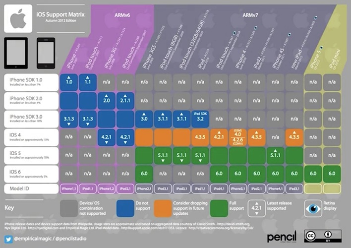

# Embedded Software Engineering

#### **[⇐ Embedded Systems](./README.md)**
---

### Steps

#### Code Design and Architecture

- Flow Diagram: A flow diagram can depict, how a particular piece of software or algorithm should behave
    - Algorithm based
    - Shows functional behavior
    - Conditional decisions
    - High-level function calls

- Software blocks :  Depict how different blocks of code communicate and connect to one another. A Software Block Diagram can also depict a software system in layers.
    - C-files are "modules"
    - Many definitions
    - Functions interact with other modules
    - Eventually interact with Hardware

    

### Software in Layers
* **Device Drivers** (Low level software)
    - Interface to hardware layers
    - HAL - Hardware Abstraction Layer
* **Bootloader**
    - Software that boots or starts the system
* **Operating System (OS)**
    - Abstracts High from Low levels
    - Scheduling
    - Resource management
* **Libraries** for shared code
* **User Application** (High level software)

    

### Hardware Abstraction

**Bare-metal Firmware (FW)**
- Software that directly interacts with hardware.
- Low level control

**Hardware Abstraction Layer (HAL)**
- Segmenting hardware interface
- Allows the application layer developer to write platform independent code.
- Portable interface

### Software Block design
* Component design
    - Defines small functional software blocks that have certain tasks, along with interface mechanism and the specs each modules must follow.
    - Helps building modulized software that is reusable  across different systems, architectures and platforms, allowing easy migration of certain software solutions without significant system changes.
    - Layers:
        - **Hardware Firmware Layer** - Controls peripheral hardware
            - **Extracted Interface** - Hardware independent
        - **High-level Communication Library Interfaces**
        - **Control Library** - Utilizes hardware interfaces

### On-target Testing
On-target testing is installing code on to particular embedded system instead of another.

### Software Engineer Tools
[Embedded Software Engineering Tools](Embedded-Engineering-Tools.md#software-engineer-tools).

### Principles of High Quality Software

Build and design embedded software that is:

 - Maintainable
 - Testable
 - Portable
 - Robust
 - Efficient
 - Consistent
 
Keeping these in mind helps to write better code, speed up development by using all code and produce system bug free software.

### Programming Languages
[Programming languages used in embedded engineering](Embedded-Engineering-Tools.md#languages).

---

## Software Configuration Management | SCM

Software configuration management or SCM is a process used by software teams to develop software projects.

This process contains a diverse set of goals and guidelines that dictate the software processes for-

--- 
[Used directly by software engineers in development]

* **Software Requirements** - Software teams will use Version Control and Software Review along with specific coding standards, as the methodology for software code storage and change requirements.
* **Environment Information** (IDEs, toolchains, simulators, Docker)
* **Software Build and Release** (Tools: GNU Make/CMake/SCons, GCC)

* **Software Review** - usually combined with version control as a way to prevent poorly designed software contributions into a project.
* **Version control** (Git, SVN, Mercurial) - Allows to track all the changes made to a software project indefinitely

---
[Used to help organize and support software projects]
* **Testing**
* **Support**
* **Documentation**
* **Defect Tracking**
* **Task Management** (Jira)

---

There are often more topics that were not listed, and sometimes these topics are even broken down into further granularity. 

### Software Requirements

### Environment Information
A development environment will be where an engineer can actually develop code by providing many integrations with things like testing, building and installation.

## Embedded Software Configuration Management

## Software Support

### Legacy Systems
Older systems that may or may not be supported anymore

Reasons:
- Software or hardware is outdated
- A loss of compatibility
- Parts not available
- Off-company roadmap

## Development Environment
[Development Environment](Embedded-Engineering-Tools.md#development-environment).

## Documentation