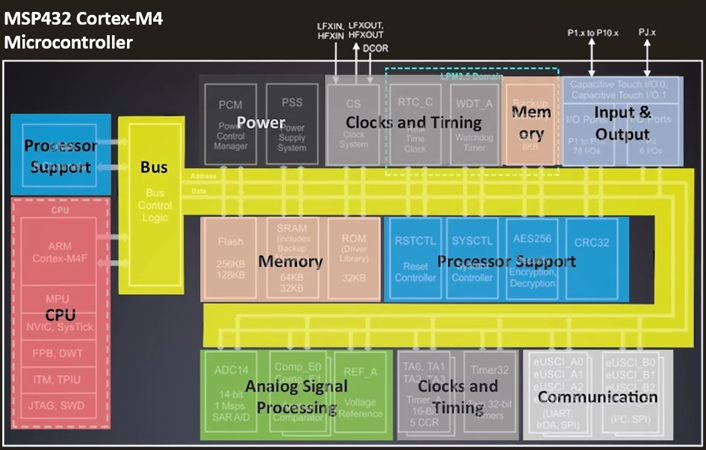

# Embedded Systems
Embedded System Study Materials

---
**[⇐ Tech Study](https://github.com/Ihtheram/Tech-Study)**

* **[Embedded Software Engineering](./Embedded-Software-Engineering.md)**
* **[Embedded Engineering Tools](Tools/README.md)**
    - **[C](./Tools/C.md)**
    - **[Ubuntu CLI](./Tools/Ubuntu-CLI.md)**
    - **[Version Control](./Tools/Version-Control.md)**
* **[Electrical Engineering Concepts](./Electrical-Engineering-Concepts.md)**
---

## Embedded System
An embedded system is a computerized system that is custom-made for its application. Each embedded system has resource constraints in processing, memory, and peripherals.

## Differences between an embedded system and a general-purpose computer

1. **Functionality**: Embedded systems are designed for specific tasks, while general-purpose computers can run a variety of applications.
2. **Resource Constraints**: Embedded systems often have limited processing power, memory, and storage compared to general-purpose computers.
3. **Real-Time Operation**: Many embedded systems operate in real-time, meaning they must respond to inputs or events within a strict time frame, which is less critical for general-purpose computers.

## Some essential components for developing an embedded systems project

Developing an embedded systems project requires a mix of hardware and software components to ensure reliability, efficiency, and functionality. Here are some of the essentials:

### Hardware Components
1. **Microcontroller (MCU) or Microprocessor (MPU)** – The brain of the system, responsible for processing data, executing instructions and handling inputs/outputs. A microcontroller is a microprocessor with added functionality such as memory and peripheral hardware.
2. **Memory (RAM & ROM/Flash Storage)** – RAM for temporary data storage and flash memory/ROM for firmware and program storage.
3. **Power Supply Unit** – Ensures stable voltage and current for reliable operation.
4. **Sensors & Actuators** – Depending on the application, sensors collect environmental data (temperature, motion, etc.), while actuators enable interaction with the physical world.
5. **Communication Interfaces** – Essential for data transfer, such as UART, SPI, I2C, or wireless protocols like Wi-Fi and Bluetooth.
6. **Display & User Interface Components** – LCDs, LEDs, or touch panels for user interaction.
7. **PCB & Supporting Components** – Circuit boards, resistors, capacitors, and connectors to enable smooth electrical integration.

### Software Components
1. **Embedded Operating System or Firmware** – Controls hardware and manages tasks efficiently.
2. **Bootloader** – Helps initialize the system and load firmware updates.
3. **Communication Protocols** – Enables data exchange between components or external systems.
4. **Programming Environment & Development Tools** – Tools and software used to write, test, and debug the code like IDEs, compilers, and debugging tools, such as Arduino IDE, Keil, or Eclipse. 
5. **Real-Time Operating System (RTOS)** – If the project demands real-time task scheduling and execution, options like FreeRTOS or Zephyr can be valuable.
6. **Security & Encryption Mechanisms** – Protects data and ensures system integrity, especially for IoT applications.

### Platform Components in Embedded Development

- **Host Machine**
- **Development Environments** to write and test code in
- **Compiler Toolchain** to generate designs (GCC, GNU)
- **Development Kits** to integrate with
- **Version Control** to track software history

### Key Considerations
- **Power Efficiency** – Optimizing consumption for battery-powered devices.
- **Thermal Management** – Prevents overheating and ensures longevity.
- **Expandability & Scalability** – Designing with future upgrades or modifications in mind.

## CPU, Microprocessor and Microcontroller

- The CPU is the core logical processing unit.
- The Microprocessor is a physical IC that contains a CPU and often cache, MMU, and bus interfaces, but requires external memory and peripherals to form a complete system.
- The Microcontroller is a complete "computer on a chip," integrating the CPU, memory, and a wide array of peripherals, designed for embedded applications.

---

### Embedded CPU (Central Processing Unit) Components

An embedded CPU, in the context of an embedded system, refers specifically to the processing core that executes instructions. It generally **requires external components** for memory, I/O, and peripherals to form a complete functional system.

* **Control Unit (CU):** Directs and coordinates all operations within the CPU and manages the flow of data and instructions. It decodes instructions and generates control signals.
* **Arithmetic Logic Unit (ALU):** Performs arithmetic operations (addition, subtraction, etc.) and logical operations (AND, OR, NOT). It's the "calculator" of the CPU.
* **Registers:** Small, high-speed storage locations within the CPU used to temporarily hold data, instructions, and addresses during processing. They provide quick access to frequently used information.
    * **Instruction Register (IR):** Holds the instruction currently being executed.
    * **Program Counter (PC):** Stores the memory address of the next instruction to be fetched.
    * **Stack Pointer (SP):** Points to the top of the stack in memory, used for function calls and local variables.
    * **General Purpose Registers (GPRs):** Used by the programmer to store data and intermediate results.
* **Internal Bus:** A set of electrical pathways within the CPU that allow different components (ALU, CU, registers) to communicate with each other.

---

### Embedded Microprocessor Components

An embedded microprocessor is a CPU on a single integrated circuit (IC) but typically **requires external memory and peripheral chips** to form a complete system. It's more powerful and flexible than a microcontroller but less integrated.

* **CPU Core(s)**: Contains all the components of a CPU (ALU, Registers, Control Unit).
* **Memory Interface:** Circuitry that allows the microprocessor to communicate with external memory chips (RAM for volatile data, ROM/Flash for program code and non-volatile data).
* **Bus Interface Unit (System Bus):** A set of electrical lines (address bus, data bus, control bus) that connect the microprocessor to external memory, I/O devices, and other peripherals.
    * **Address Bus:** Carries memory addresses from the CPU to memory and I/O devices.
    * **Data Bus:** Carries data between the CPU, memory, and I/O devices.
    * **Control Bus:** Carries control signals (e.g., read/write, enable) to coordinate operations.
* **Clock Generation Unit:** Generates the timing signals (clock cycles) that synchronize all operations within the microprocessor and the connected system.
* **Interrupt Controller (often external):** Manages interrupt requests from various peripherals, allowing the CPU to respond to external events efficiently.
* **Debug Interface / Debug Logic**: Allows external debugging tools to observe and control the internal state of the processor and the entire system by implementing the low-level communication protocol (e.g., JTAG - Joint Test Action Group, SWD - Serial Wire Debug), which helps monitor, control the execution of programs, troubleshooting installed programs, allowing engineers to step through code, set breakpoints, and inspect the flow of execution to find where things may be going wrong.

---

### Embedded Microcontroller Components

An embedded microcontroller is a "computer on a chip," integrating a CPU, memory, and various input/output (I/O) peripherals onto a **single integrated circuit**. This high level of integration makes them ideal for compact, cost-sensitive, and dedicated applications.

* **CPU Core(s)**: Contains all the components of a CPU (ALU, Registers, Control Unit).
* **On-Chip Memory:**
    * **Program Memory (Flash/ROM/EEPROM):** Non-volatile memory that stores the firmware (program instructions) that the microcontroller executes. Flash memory is commonly used as it can be electrically erased and reprogrammed.
    * **Data Memory (RAM):** Volatile memory used for temporary storage of data, variables, and the stack during program execution.
* **Input/Output (I/O) Peripherals:** These are integrated hardware modules that allow the microcontroller to interact with the external world.
    * **General Purpose Input/Output (GPIO) Ports:** Configurable pins that can be set as inputs (to read switches, sensors) or outputs (to control LEDs, relays).
    * **Timers/Counters:** Hardware modules that can measure time intervals, generate delays, count external events, or generate Pulse Width Modulation (PWM) signals for motor control, dimming LEDs, etc.
    * **Analog-to-Digital Converters (ADC):** Convert analog signals from sensors (e.g., temperature, pressure, light) into digital values that the CPU can process.
    * **Digital-to-Analog Converters (DAC):** Convert digital values from the CPU into analog signals, for example, to control analog actuators or generate audio.
    * **Communication Interfaces:** Dedicated hardware modules for communicating with other devices:
        * **UART (Universal Asynchronous Receiver/Transmitter):** For serial communication with devices like GPS modules, Bluetooth modules, or a PC.
        * **SPI (Serial Peripheral Interface):** A high-speed synchronous serial communication interface for communicating with sensors, memory chips, and other microcontrollers.
        * **I2C (Inter-Integrated Circuit):** A two-wire serial communication bus often used for communicating with sensors, EEPROMs, and real-time clocks.
        * **USB (Universal Serial Bus), Ethernet, CAN Bus:** More advanced communication interfaces found on higher-end microcontrollers for more complex networking or device connectivity.
* **Interrupt Controller:** Integrated module that handles and prioritizes interrupt requests from various on-chip peripherals and external pins, allowing the CPU to respond quickly to events.
* **Debug Interface / Debug Logic**: Allows external debugging tools to observe and control the internal state of the processor and the entire system by implementing the low-level communication protocol (e.g., JTAG - Joint Test Action Group, SWD - Serial Wire Debug), which helps monitor, control the execution of programs, troubleshooting installed programs, allowing engineers to step through code, set breakpoints, and inspect the flow of execution to find where things may be going wrong.
* **Bus Interface Unit (System Bus):** A set of electrical lines (address bus, data bus, control bus) that aids in data transmission between memory and peripherals.
* **Clock Circuitry** (Oscillator): Provides the timing signals for all operations on the chip. Often, an internal RC oscillator or external crystal can be used.
* **Watchdog Timer:** A safety feature that resets the microcontroller if the program gets stuck or unresponsive, preventing system failures.
* **Power Management Unit (PMU):** Manages power consumption, often including low-power modes to extend battery life in portable applications.

## Peripherals in Microcontroller

* Communication
* Analog signal processing (e.g. ADCs and DACs)
* Input/Output
* Timing
* Processor support

## Q&A

**What do you think are some examples of applications where embedded systems are crucial?**

- **Smart Thermostat**: 

    - **Relevance**: A smart thermostat is designed to control the heating and cooling of a home efficiently. It uses sensors to monitor temperature and adjusts the HVAC system accordingly.
    - **Connection**: This system is purpose-built, with limited resources, focusing on optimizing energy use while maintaining comfort.
- **Washing Machine**: 

    - **Relevance**: Modern washing machines have embedded systems that control wash cycles, water levels, and spin speeds based on the load and fabric type.
    - **Connection**: The embedded system in the washing machine is designed specifically for laundry tasks, using a microcontroller to manage its operations efficiently.
- **Automotive Control Systems**: 

    - **Relevance**: Cars use embedded systems for various functions, such as engine control, anti-lock braking systems (ABS), and airbag deployment.
    - **Connection**: These systems are critical for safety and performance, designed to operate under specific constraints and conditions, ensuring the vehicle runs smoothly.
- **Fitness Tracker**: 

    - **Relevance**: A fitness tracker monitors physical activity, heart rate, and sleep patterns, providing users with insights into their health.
    - **Connection**: It is an embedded system that focuses on health monitoring, using sensors and a microcontroller to process data efficiently without needing extensive resources.
- **Home Security System**:
    - **Relevance**: A home security system uses embedded systems to monitor for intrusions, control cameras, and send alerts to homeowners.
    - **Connection**: This system is designed for a specific purpose—keeping homes safe—using limited processing power and memory to perform its tasks effectively.

What role does each components play in the overall functionality of an embedded system? Can you elaborate on how they interact with each other?

- **Microcontroller**: It processes inputs from sensors and controls outputs to actuators or displays. It runs the embedded software that dictates how the system behaves.
- **PCB**: It physically supports and connects the microcontroller to other components, such as sensors, power supplies, and communication interfaces. The layout of the PCB is crucial for ensuring proper signal integrity and power distribution.
- **Peripheral Devices**: These can include sensors (to gather data), actuators (to perform actions), and communication modules (to connect with other systems). They interact with the microcontroller to provide functionality.

**How do you think the choice of microcontroller affects the design and performance of an embedded system?**

The choice of microcontroller is **critical** in shaping the design and performance of an embedded system. It influences everything from power consumption and processing speed to memory availability and connectivity options. 

- **Processing Power:** A more powerful microcontroller can handle complex computations and multitasking but may consume more power.
- **Memory Constraints:** The amount of RAM and Flash storage affects the system's ability to run larger programs and store data.
- **Peripherals & Interfaces:** The available communication protocols (SPI, I2C, UART, etc.) determine how the microcontroller interacts with other components.
- **Power Consumption:** Battery-powered systems need ultra-low-power microcontrollers to maximize efficiency.
- **Cost & Scalability:** More advanced microcontrollers come at a higher cost, impacting overall project feasibility.

Picking the right microcontroller means balancing performance, efficiency, and cost.

**True or False? An embedded system is designed to work with a variety of applications dynamically, similar to general computer systems.** Answer: False.

**Which of the following components is NOT typically part of an embedded system?**

A) Processing core
B) External circuits
C) General-purpose operating system
D) Software image

**Describe the role of the Central Processing Unit (CPU) in a microcontroller.**

**What are some of the constraints that embedded systems face compared to general-purpose computers?**

**True or False? The Arithmetic Logic Unit (ALU) is responsible for performing high-level programming tasks in an embedded system.** Answer: False.

---
**[⇐ Tech Study](https://github.com/Ihtheram/Tech-Study)**

* **[Embedded Software Engineering](./Embedded-Software-Engineering.md)**
* **[Embedded Engineering Tools](Tools/README.md)**
    - **[C](./Tools/C.md)**
    - **[Ubuntu CLI](./Tools/Ubuntu-CLI.md)**
    - **[Version Control](./Tools/Version-Control.md)**
* **[Electrical Engineering Concepts](./Electrical-Engineering-Concepts.md)**
---