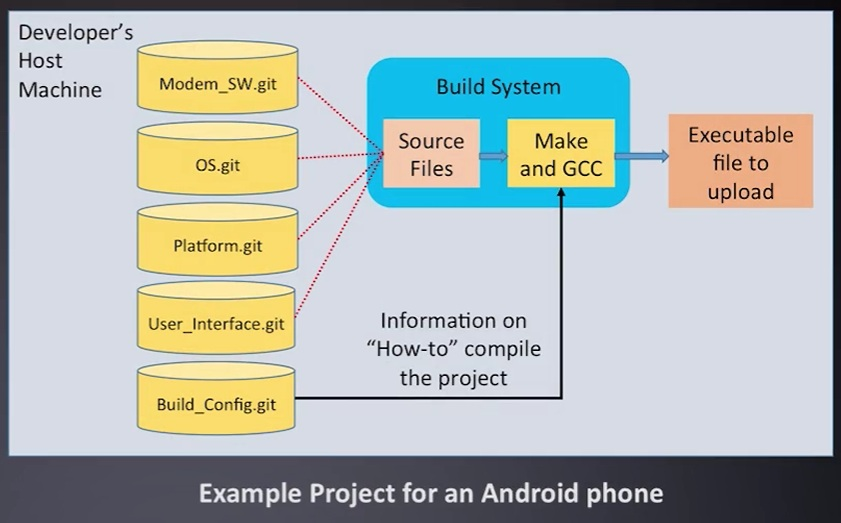
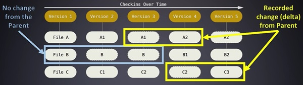
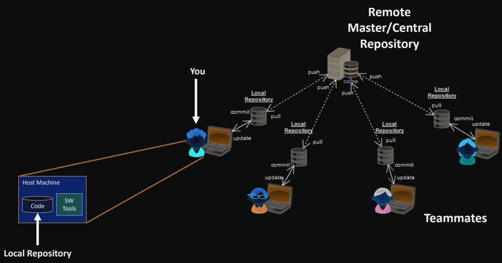

# Version Control

#### **[⇐ Embedded Engineering Tools](../Embedded-Engineering-Tools.md)**
---

## Version Control System (VCS) / Revision Control System (RCS)

A software package that allows users to track changes in a project over time.

### VCS Types

* Concurrent Versions Systems (CVS)
* Subversion (SVN)
* Mercurial
* IBM Rational ClearCase
* **git**
    - Used by Linux Kernel, Google's Android, Twitter, GNU Toolchain

### VCS Features

Allows to track items such as

* Software
* Documents
* Build Information
* Configuration information, or even 
* Compiled build release of a project for customers to download

## git

* **Repository** / Repo - Collection of tracked files, acts like a normal file system

    - Each different software project will have its own distinct repository

    - Multiple repositories like components or plugins can be combined to create a large software project. For example Google Nexus



* `git init` - Initializes current directory as a new git repository.

* **.git** folder - Holds configuration files for the repository, should not be modified by user.

* **Commits** - Tracked changes in logical groupings

    - Single/Multiple file changes
    - New or removed files

    * `git show` - The  command is used to see the latest commit metadata information

    * `git log` - The  command is used to see commits with a list of some of the commit metadata information

    * **metadata** - Tracking information of the commit. Includes followings:
        
        * SHA-1 Commit ID - A 40 character unique ID
        * Author of change-set (User who made the change)
        * Date of change
        * Commit Comment
        * File change list       
        * Parent commit (the previous commit) -  Each new commit contains information on the changes from the previous state of the repository


```git
commit 9c7d4e1f8b3a0c6d9f8e7a2b1c5d4e3f2a1b0c9d
Author: Emily Davis <emily.davis@example.com>
Date:   Mon Oct 28 15:30:45 2024 -0700

    feat: Add user profile management feature

diff --git a/app/routes.rb b/app/routes.rb
index e3f2d1a..f8e9a2b 100644
--- a/app/routes.rb
+++ b/app/routes.rb
@@ -5,6 +5,7 @@
     get '/users', to: 'users#index'
     post '/users', to: 'users#create'
     get '/posts', to: 'posts#index'
+    get '/profile', to: 'profile#show'
 end
```




*Git tracks revisions by looking at the deltas (the changes) between each successive commit, as not every file may change.*


### Collaboration


* Changes to code on the host are local until pushed to remote repositories
* Everyone has a copy of the main repository on their machine Referred to as the remote “origin”
* Other team members are also Remote repositories. You can keep local copies of their repositories too.


#### Branch
    - Creating a workspace for one’s code separated from others
    - To split off on different subsets of a project and reintegrate later

* Untracked files - new files
* Modified files - files that has been changed 
* Staged files - files that are added to stage before committing
* `git status` - shows status of the files, which are untracked, which are modified and which are staged.
* `git push` - push staged changes to remote origin
* `git fetch` - fetch changes from remote origin to local repo
* `git merge` - merge fetched changes from remote origin with local repo
* `git pull` - fetches and merges changes from remote origin with local repo, alternative to fetch and merge commands.


### Resolving Conflicts
Resolving conflicts is done by analyzing the differences between software sets and creating a new commit that represents the merge development of the two developers. A manual process my be used to resolve conflicting files and merge into a single file. 

* `git diff` - allows to investigate the changes in files around focused areas between commits.
* `git merge`
* `git rebase`


## Project Setup
* `git clone <url>`
* `git config --local user.name "{username}"`
* `git config --local user.email "{email}"`


